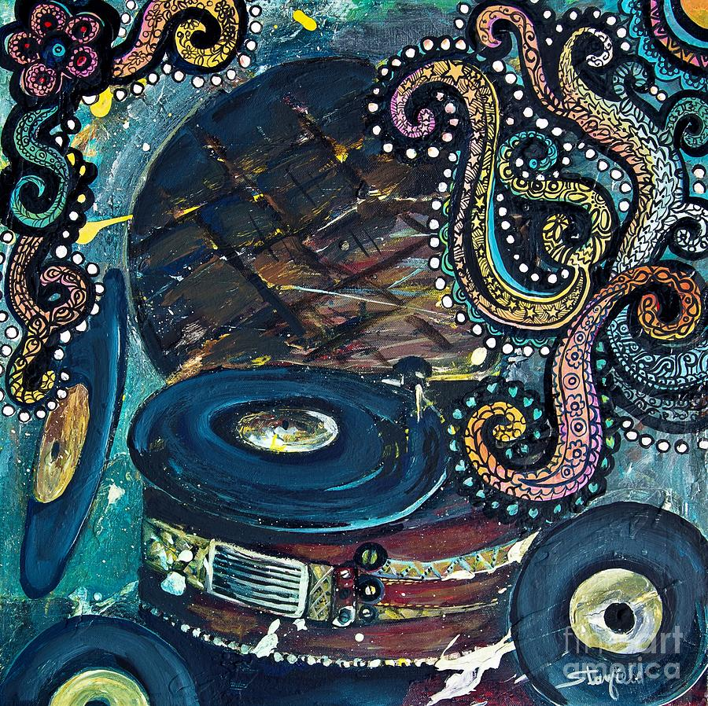

# ykua0361_9103_tut4_ Quiz 8

## Part 1: Imaging Technique Inspiration
Inspired by the following two images, I considered using circles and some lines to complete the project. I wanted to refer to the structure of the graphic arrangement in image one because it is very neat, has sharp colors and makes the image very presentable. The ‘Record’ element in image two made me think that the project could add some sound and have the circle spinning like a record. The whole screen of the project that I envisioned looks like a record with colorful dots being played.

_[Image 1] Wheels of fortune by Pacita Abad_

_[Image 2] Around We Go - Vintage Record player by Johnnie Stanfield_

## Part 2: Coding Technique Exploration: Imaging Technique Inspiration
This coding use functions like `translate()` and `rotate()`, the code manipulates the position and rotation of shapes. By updating the angle of rotation (`angle`) in the `draw()` function over time, objects appear to move smoothly. The `for` loop iterates over the outer squares, applying translations and rotations to position them around the central square. I think the technique used in this example can help achieve the desired effect of spinning records with colored dots.

[CP1: Animation Basics – Rotation
by jeffThompson](https://editor.p5js.org/jeffThompson/sketches/e5SmpCiCB)

